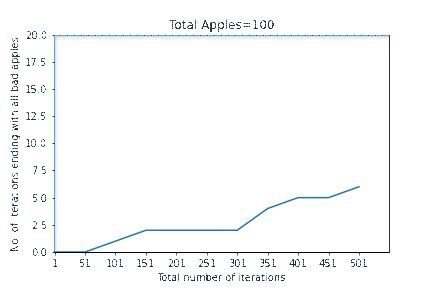

In this project, we explore the extent of truth in the adage 'One bad apple can spoil the bunch'.
We use core python for our logic, matplotlib to visualize and pillow to save the visualization as a gif, which comes out to be like this:
